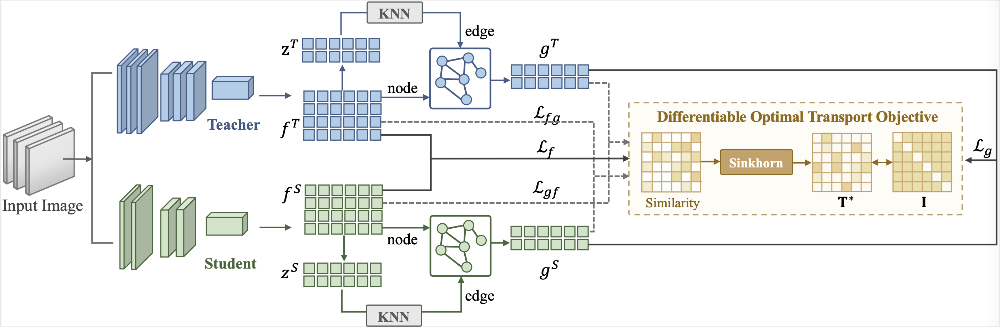

# OTGD

Code for ICONIP 2024 paper "Knowledge Distillation with Differentiable Optimal Transport on Graph Neural Networks"





## Installation
```
conda install --yes --file requirements.txt
```

## Running

1. Fetch the pretrained teacher models by:

    ```
    sh scripts/fetch_pretrained_teachers.sh
    ```
   which will download and save the models to `save/models`

2. Run distillation by commands in `scripts\run_cifar_distill.sh`. An example of running OTGD is given by:

    ```
    python train_student.py --path_t ./save/models/resnet32x4_vanilla/ckpt_epoch_240.pth --distill ceot --model_s resnet8x4 -a 1 -b 1 --mode hkd --trial 1
    ```

## Citation

```
@InProceedings{Zhou_2021_ICCV,
    author    = {Zhou, Sheng and Wang, Yucheng and Chen, Defang and Chen, Jiawei and Wang, Xin and Wang, Can and Bu, Jiajun},
    title     = {Distilling Holistic Knowledge With Graph Neural Networks},
    booktitle = {Proceedings of the IEEE/CVF International Conference on Computer Vision (ICCV)},
    month     = {October},
    year      = {2021},
    pages     = {10387-10396}
}
```

## Acknowledgement
This repo is based on the implementation of [CRD](https://github.com/HobbitLong/RepDistiller).
